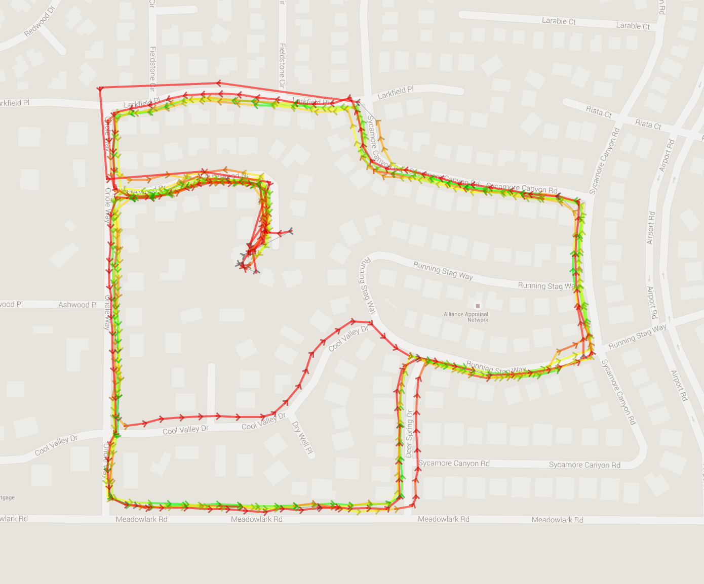

## Setup

### Download `nupic.geospatial`

This is Numenta's example application for using the NuPIC HTM implementation to analyze GPS tracks.

    git clone https://github.com/numenta/nupic.geospatial.git

Let's also get some paths saved, because we'll be working out of two repos.

    export NPC_WS_PART2=`pwd`
    export NPC_GEO=`pwd`/nupic.geospatial

If you cloned `nupic.geospatial` to a different file system location, you will need to adjust the export above.

## Convert GPX files into NuPIC input

There are some sample data files in the `paths/dog_walks` folder. You can put your GPX files in the `paths/` folder and process them in the same fashion.

First, we'll create a directory for the processed data to be written to.

    mkdir $NPC_WS_PART2/processed_gps_paths

Now we can run the conversion script to process the GPX tracks into input for the HTM.

    $NPC_GEO/tools/convert_gpx.py ./paths/dog_walks -o $NPC_WS_PART2/processed_gps_paths/

You should now have a file at `$NPC_WS_PART2/processed_gps_paths/dog_walks.csv`

## Running Converted Tracks Through `nupic.geospatial`

Now that you have converted your GPX files into the proper format for `nupic.geospatial`, there is another script to run them through NuPIC.

    $NPC_GEO/run.py $NPC_WS_PART2/processed_gps_paths/dog_walks.csv

## Start the Web Server and View Results

    cd $NPC_GEO
    python server.py
    open http://localhost:5000/
